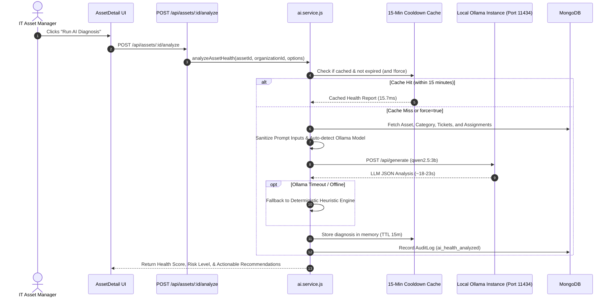

# AssetOwl AI Health Diagnostic Engine Guide

## 1. AI Architecture Overview

AssetOwl integrates with a local **Ollama** LLM instance (`qwen2.5:3b` or `llama3:8b`) to provide automated hardware degradation analysis, failure risk predictions, and lifecycle recommendations.



---

## 2. Model Discovery & Input Sanitization

### Dynamic Model Auto-Selection
[`backend/src/services/ai.service.js`](file:///c:/Projects/assetIQ-v2/backend/src/services/ai.service.js) queries `GET http://127.0.0.1:11434/api/tags` on startup and dynamically chooses the best available local model:
1. `qwen2.5:3b` (Preferred: high JSON compliance & speed)
2. `llama3:8b`
3. `mistral:7b`
4. `llama2:latest`

### Prompt Injection Sanitization
To prevent prompt injections or malicious input hijacking via user-controlled asset names or notes:
```javascript
const sanitize = (str) => {
  if (!str) return 'N/A';
  return String(str)
    .replace(/[\r\n\t]+/g, ' ')
    .replace(/[{}[\]]/g, '')
    .slice(0, 80)
    .trim();
};
```

---

## 3. Cooldown Caching & Performance

### Why Cooldown Caching Exists
Running an 8-billion parameter local model on commodity hardware requires 15–25 seconds of compute. Since asset hardware specs and age do not change second-by-second, running uncached evaluations on every page view degrades server responsiveness.

### Performance Comparison

| Evaluation Type | Latency | Compute Utilization |
|-----------------|---------|---------------------|
| **Uncached Ollama Inference** | ~18,900 ms (18.9s) | 100% CPU / GPU burst |
| **Cached Memory Hit (< 15 min)** | **15.7 ms** | 0% (Instant RAM lookup) |
| **Speedup Factor** | **~1,200x – 1,500x faster** | Negligible server load |

*(Note: Users can bypass the cache by passing `?force=true` or clicking "Force Re-evaluate" in the UI).*

---

## 4. Deterministic Heuristic Fallback

If the local Ollama daemon is offline, times out (45s), or returns unparseable output, `ai.service.js` automatically engages the heuristic fallback engine:

$$\text{Health Score} = 100 - \text{Age Penalty} - \text{Ticket Penalty} - \text{Status Penalty}$$

- **Age Penalty**: Evaluates asset age in months against `Category.expectedLifespanMonths`.
- **Ticket Penalty**: Deducts 12 points per open hardware maintenance ticket.
- **Status Penalty**: Deducts 25 points if currently in `'repair'` status.

---

## 5. Current Implementation vs Future Architecture

### Currently Implemented
- Synchronous Express endpoint with rate limiting (`aiLimiter`).
- In-memory 15-minute diagnosis caching with `force=true` bypass.
- Automated fallback to deterministic heuristics.

### Planned Future Architecture (Post-MVP)
- Asynchronous BullMQ background worker queue with Redis for batch evaluations.
- `202 Accepted` response with real-time Socket.IO completion notification.
