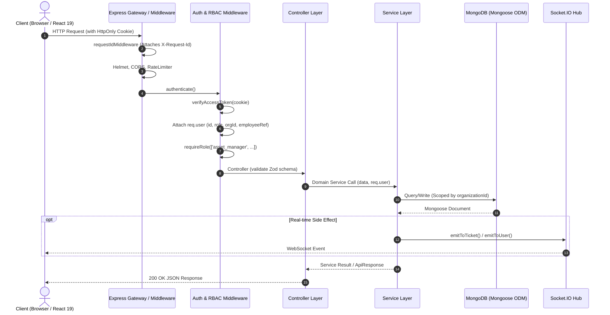

# AssetOwl Architecture Guide

## 1. Architectural Philosophy: The Modular Monolith

AssetOwl is structured as a **clean, layered modular monolith**. 

### Why a Modular Monolith?
- **Unified Domain Transactionality**: Asset custody transfers, ticket updates, and audit logging require strong consistency without the complexity of distributed two-phase commits (2PC) or saga orchestrators.
- **Low Operational Overhead**: A single Node.js runtime handles REST APIs, Socket.IO WebSockets, and AI orchestrations with minimal infrastructure footprint.
- **Zero Inter-Service Network Latency**: Internal communications between asset tracking, personnel custody, and notifications occur in-process within sub-millisecond function calls.
- **Why Microservices Are Unnecessary**: At the current SaaS scale (hundreds of organizations, tens of thousands of assets), horizontal scaling of the single stateless backend container behind an Nginx/ALB load balancer provides orders of magnitude more scalability and reliability than a fragmented microservices topology.

---

## 2. System Layering & Request Pipeline

---

## 3. Layer Responsibilities & Boundaries

### 1. Gateway & Middleware Layer (`backend/src/middleware/`)
- **What Belongs Here**:
  - `requestId.middleware.js`: Attaches unique UUID `req.id` to every request and injects `X-Request-Id` response header.
  - `auth.middleware.js`: Extracts access token from cookies (or Bearer header), validates signature, and builds `req.user`.
  - `rbac.middleware.js`: Restricts route access by user role (`super_admin`, `org_admin`, `asset_manager`, `employee`).
  - `validate.middleware.js`: Validates `req.body` against Zod schemas and strips unparsed keys.
  - `rateLimiter.middleware.js`: Protects authentication, public registration, AI evaluation, and general API endpoints from abuse.
  - `error.middleware.js`: Global error trap. Transforms `ApiError`, `ZodError`, and unexpected exceptions into structured JSON responses while masking internal stack traces in production.
- **What Must NOT Belong Here**: Database mutations or business domain logic.

### 2. Controller Layer (`backend/src/controllers/`)
- **What Belongs Here**:
  - Extracting route parameters (`req.params`), query strings (`req.query`), and validated payloads (`req.body`).
  - Passing contextual identities (`req.user`) to service methods.
  - Returning standardized HTTP status codes and `ApiResponse` instances.
- **What Must NOT Belong Here**: Direct database queries, Mongoose calls, or complex multi-step validations.

### 3. Service Layer (`backend/src/services/`)
- **What Belongs Here**:
  - Pure business logic (e.g., verifying asset is in `stock` before assigning; ensuring custody is returned before deleting personnel).
  - Enforcing tenant isolation by injecting `organizationId` into database queries.
  - Creating immutable audit logs via `logAudit()`.
  - Triggering real-time WebSocket events and in-app notifications.
- **What Must NOT Belong Here**: Direct HTTP request/response handling or cookie manipulation.

### 4. Persistence Layer (`backend/src/models/`)
- **What Belongs Here**:
  - Mongoose schema definitions, field validations, default values, and timestamps.
  - Compound database performance indexes.
  - Pre-save and immutability safety hooks (e.g., append-only enforcement on `AuditLog`).

---

## 4. Architectural Decision Records (ADRs)

### ADR-01: HttpOnly Cookie-Based JWT Auth with Dual Secret Separation
- **Decision**: Issue access tokens (15m) and refresh tokens (7d) in separate `HttpOnly`, `SameSite` cookies signed by independent cryptographic secrets (`JWT_SECRET` vs `REFRESH_TOKEN_SECRET`).
- **Why**: Prevents Cross-Site Scripting (XSS) token theft since JavaScript cannot read HttpOnly cookies. Separate secrets ensure that a compromise of the access token signing key does not allow an attacker to forge long-lived refresh tokens.

### ADR-02: Route-Level Frontend Code Splitting
- **Decision**: Use `React.lazy()` and `Suspense` for all 28 page routes in [`AppRouter.jsx`](file:///c:/Projects/assetIQ-v2/frontend/src/router/AppRouter.jsx).
- **Why**: Reduced initial JavaScript bundle download from **1.5MB** to **497 kB** (**-67%**), eliminating browser parse stalls on initial load.

### ADR-03: Local LLM AI Evaluation with 15-Minute Cooldown Caching
- **Decision**: Integrate Ollama directly via local HTTP API with an in-memory 15-minute diagnosis cooldown cache and heuristic fallback.
- **Why**: Uncached LLM evaluation takes ~23s per asset. Caching reduces response time for repeated views to **15.7ms** (~1,500x speedup) and prevents local GPU/CPU exhaustion.

### ADR-04: Logical Multi-Tenancy with Indexed Tenant IDs
- **Decision**: Store all tenants in a shared database collection partitioned by indexed `organizationId` foreign keys.
- **Why**: Provides high tenant density, instant tenant provisioning, and simplified global migrations while maintaining strict isolation at the query and WebSocket layers.

---

## 5. Failure Modes & Resilience Strategies

| Failure Scenario | Impact | Built-in Mitigation |
|------------------|--------|---------------------|
| **Database Connection Loss** | API requests fail | `GET /api/health` reports `503 Service Unavailable`; server logs critical Winston error with stack trace. |
| **Ollama Local LLM Offline** | AI health evaluation requested | AI service catches connection timeout (45s) and automatically falls back to deterministic heuristic health calculation. |
| **Expired Access Token** | Protected API call fails with 401 | Axios interceptor automatically intercepts 401, calls `POST /api/auth/refresh`, and transparently replays original request. |
| **Concurrent Warranty Check Calls** | Duplicate alert notifications | Mutex execution lock (`isWarrantyCheckRunning`) rejects concurrent overlapping executions with a warning log. |
