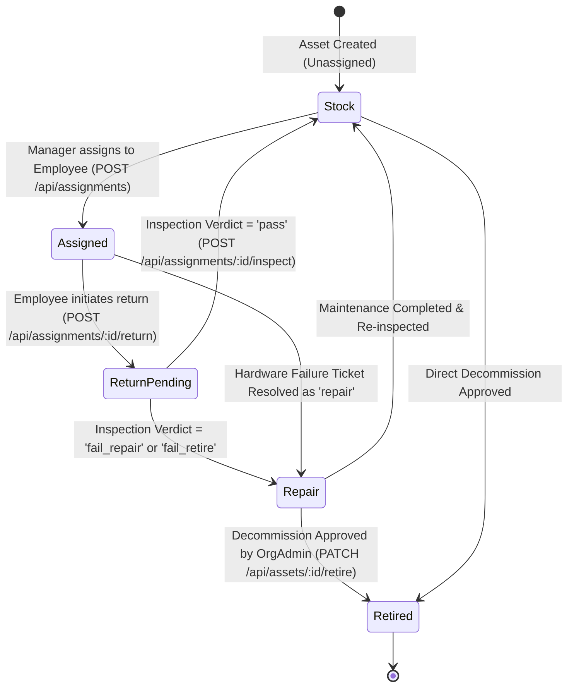

# AssetOwl Asset Lifecycle & Custody Guide

## 1. Asset Lifecycle State Machine

Physical hardware in AssetOwl transitions through four formal states:

---

## 2. Core Lifecycle Stages & Business Rules

### 1. Creation & QR Code Provisioning
- **Role**: `asset_manager`, `org_admin`, `super_admin`
- **Route**: `POST /api/assets`
- **Service**: [`asset.service.js:createAsset`](file:///c:/Projects/assetIQ-v2/backend/src/services/asset.service.js)
- **Rules**:
  - `assetCode` must be unique within the organization.
  - Automatically generates an inline base64 QR code (`getAssetQrCode`) encoding asset identity and deep links for quick scanning on mobile devices.
  - Initial status defaults to `'stock'`.

### 2. Assignment to Custodian
- **Role**: `asset_manager`, `org_admin`, `super_admin`
- **Route**: `POST /api/assignments`
- **Service**: [`assignment.service.js:createAssignment`](file:///c:/Projects/assetIQ-v2/backend/src/services/assignment.service.js)
- **Database Changes**:
  1. Verifies `asset.status === 'stock'` and no active assignment (`returnedAt: null`) exists.
  2. Creates new `Assignment` record with `assignedBy`, `assignedAt`, `employeeId`, and `assetId`.
  3. Updates `asset.status = 'assigned'`.
  4. Dispatches `asset_assigned` notification to the employee's user account.
  5. Records `assignment_created` and `asset_state_change` in `AuditLog`.

### 3. Return Initiation (Self-Service or Admin)
- **Role**: `employee` (for own equipment), `asset_manager`, `org_admin`
- **Route**: `POST /api/assignments/:id/return` or `POST /api/assets/:id/return`
- **Service**: [`assignment.service.js:initiateReturn`](file:///c:/Projects/assetIQ-v2/backend/src/services/assignment.service.js)
- **Rules**:
  - Accepts either `assignmentId` or `assetId` in path parameter.
  - Resolves `employeeId` from `user.employeeRef` or email lookup to ensure an employee can only return their own assigned devices.
  - Normalizes return reason into valid enum (`'upgrade'`, `'defective'`, `'offboarding'`).
  - Sets `assignment.returnInitiatedAt = new Date()` and `assignment.returnReason`.

### 4. Manager Return Inspection Stepper
- **Role**: `asset_manager`, `org_admin`, `super_admin`
- **Route**: `POST /api/assignments/:id/inspect`
- **Service**: [`assignment.service.js:inspectAssignment`](file:///c:/Projects/assetIQ-v2/backend/src/services/assignment.service.js)
- **Inspection Verdicts**:
  - `pass`: Device is in good condition; `asset.status` moves back to `'stock'`.
  - `fail_repair`: Device has physical damage or defect; `asset.status` moves to `'repair'`.
  - `fail_retire`: Device is end-of-life/beyond repair; `asset.status` moves to `'repair'` with a flag for retirement approval.
- **Database Changes**:
  - Sets `assignment.returnedAt = new Date()`, `assignment.inspectedBy = user._id`, `assignment.inspectionResult`, and `assignment.inspectionNotes`.
  - Notifies previous employee of inspection completion.

### 5. Retirement & Decommission Authorization
- **Role**: `org_admin`, `super_admin`
- **Route**: `PATCH /api/assets/:id/retire` or `PATCH /api/assets/:id/status`
- **Service**: [`asset.service.js:approveRetirement`](file:///c:/Projects/assetIQ-v2/backend/src/services/asset.service.js)
- **Rules**:
  - Prevents retirement if asset is currently assigned to an active employee without a completed return.
  - Moves `asset.status = 'retired'`.
  - Records permanent decommission audit log.

---

## 3. Data Integrity & Custody Safeguards

### Preventing Orphaned Custody on Employee Deletion
In [`catalog.routes.js`](file:///c:/Projects/assetIQ-v2/backend/src/routes/catalog.routes.js) and [`personnel.service.js`](file:///c:/Projects/assetIQ-v2/backend/src/services/personnel.service.js), an employee record **CANNOT be deleted** if `Assignment.countDocuments({ employeeId, returnedAt: null }) > 0`. The API rejects the deletion with:
`"Cannot delete employee: N device(s) currently in custody. Return or reassign all equipment first."`

---

## 4. Key Functions Reference

### `createAssignment(data, user)`
- **File**: [`backend/src/services/assignment.service.js`](file:///c:/Projects/assetIQ-v2/backend/src/services/assignment.service.js)
- **Inputs**: `{ assetId, employeeId }`, `user` context.
- **Why It Exists**: Creates official chain of custody for enterprise hardware.
- **What Breaks If Changed**: Assets could be assigned to multiple employees simultaneously, corrupting custody records.

### `inspectAssignment(assignmentId, data, user)`
- **File**: [`backend/src/services/assignment.service.js`](file:///c:/Projects/assetIQ-v2/backend/src/services/assignment.service.js)
- **Inputs**: `assignmentId`, `{ inspectionResult, inspectionNotes }`, `user` context.
- **Why It Exists**: Closes active assignment and determines next hardware availability state.
