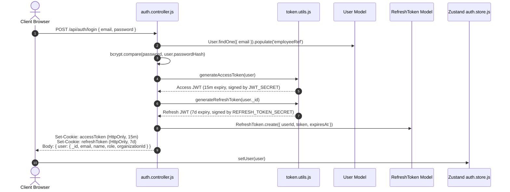

# AssetOwl Authentication & Authorization Guide

## 1. Authentication Architecture Overview

AssetOwl employs a secure, token-based authentication mechanism leveraging short-lived Access Tokens and long-lived Refresh Tokens stored in encrypted, `HttpOnly`, `SameSite` cookies.



---

## 2. Token Lifecycle & Dual-Secret Design

### Access Token
- **Secret**: `JWT_SECRET` (loaded from environment)
- **Lifespan**: 15 minutes (`JWT_EXPIRE = "15m"`)
- **Storage**: `accessToken` cookie (`HttpOnly`, `SameSite: strict` in prod, `lax` in dev)
- **Payload Structure**:
  ```json
  {
    "_id": "6a81fde4bee2c2608b14cb58",
    "email": "alice@techflow.dev",
    "role": "employee",
    "organizationId": "6a81fde4bee2c2608b14cb2c",
    "employeeRef": "6a81fde4bee2c2608b14cb57",
    "iat": 1723851000,
    "exp": 1723851900
  }
  ```

### Refresh Token
- **Secret**: `REFRESH_TOKEN_SECRET` (cryptographically separate from `JWT_SECRET`)
- **Lifespan**: 7 days (`REFRESH_TOKEN_EXPIRE = "7d"`)
- **Storage**: `refreshToken` cookie (`HttpOnly`) + Database collection (`RefreshToken`)
- **Payload Structure**:
  ```json
  {
    "_id": "6a81fde4bee2c2608b14cb58",
    "iat": 1723851000,
    "exp": 1724455800
  }
  ```

### Why Dual Secrets & HttpOnly Cookies?
1. **Isolation of Blast Radius**: If an access token secret is exposed through application memory leaks or third-party loggers, the attacker still cannot generate long-lived refresh tokens or forge persistent sessions.
2. **XSS Immunity**: Storing tokens in `HttpOnly` cookies guarantees that malicious client-side JavaScript (e.g., from an injected dependency or XSS exploit) cannot read or exfiltrate tokens via `document.cookie` or `localStorage`.
3. **Automatic Revocation**: Refresh tokens are tracked in MongoDB. When a user logs out (`POST /api/auth/logout`) or an administrator deactivates an account, the refresh token document is deleted, preventing any further access token renewals.

---

## 3. Registration Flow

### Production vs Development Registration Behavior
- **Production (`NODE_ENV=production`)**: Public organization registration is hard-blocked. A user registering via `POST /api/auth/register` **must** provide a valid `organizationCode`. The user is attached as an `employee` to the corresponding existing organization.
- **Development (`NODE_ENV=development`)**: If no `organizationCode` is provided, the system automatically provisions a test organization (`[Name]'s Organization`), creates an associated `Employee` record, and grants the registrant the `org_admin` role for rapid local feature testing.

---

## 4. Authentication & Authorization Middleware

### `authenticate` Middleware ([`backend/src/middleware/auth.middleware.js`](file:///c:/Projects/assetIQ-v2/backend/src/middleware/auth.middleware.js))
1. Extracts JWT from `req.cookies.accessToken` (with fallback to `Authorization: Bearer <token>`).
2. Calls `verifyAccessToken(token)` against `JWT_SECRET`.
3. Constructs `req.user` with exact identity properties:
   ```javascript
   req.user = {
     _id: decoded._id,
     email: decoded.email,
     role: decoded.role,
     organizationId: decoded.organizationId,
     employeeRef: decoded.employeeRef || null
   };
   ```
4. If missing, invalid, or expired, halts execution with `401 Unauthorized`.

### `requireRole` Middleware ([`backend/src/middleware/rbac.middleware.js`](file:///c:/Projects/assetIQ-v2/backend/src/middleware/rbac.middleware.js))
- Enforces role-based access control against `req.user.role`.
- Example usage: `router.post('/', requireRole(['asset_manager', 'org_admin', 'super_admin']), createAsset);`
- Throws `403 Forbidden ("Access denied")` if the user's role is not in the allowed list.

---

## 5. Role-Based Access Control (RBAC) Matrix

| Feature / Action | `super_admin` | `org_admin` | `asset_manager` | `employee` |
|------------------|:-------------:|:-----------:|:---------------:|:----------:|
| **Manage Organizations & SaaS Plans** | ✅ | ❌ | ❌ | ❌ |
| **Manage All Org Personnel & Roles** | ✅ | ✅ | ❌ | ❌ |
| **Approve / Reject Procurement Requests**| ✅ | ✅ | ❌ | ❌ |
| **Approve Asset Retirement / Decommission**| ✅ | ✅ | ❌ | ❌ |
| **Create & Edit Assets** | ✅ | ✅ | ✅ | ❌ |
| **Assign Equipment to Employees** | ✅ | ✅ | ✅ | ❌ |
| **Perform Return Inspections** | ✅ | ✅ | ✅ | ❌ |
| **Claim & Resolve Support Tickets** | ✅ | ✅ | ✅ | ❌ |
| **Trigger AI Health Diagnosis** | ✅ | ✅ | ✅ | ❌ |
| **View My Assigned Equipment** | ✅ | ✅ | ✅ | ✅ |
| **Initiate Equipment Return Request** | ✅ | ✅ | ✅ | ✅ |
| **Create Support Ticket** | ✅ | ✅ | ✅ | ✅ |
| **Ticket Discussion Chat (Own Tickets)**| ✅ | ✅ | ✅ | ✅ |

---

## 6. Key Functions Reference

### `generateAccessToken(user)`
- **File**: [`backend/src/utils/token.utils.js`](file:///c:/Projects/assetIQ-v2/backend/src/utils/token.utils.js)
- **Inputs**: User object containing `_id`, `email`, `role`, `organizationId`, and optional `employeeRef`.
- **Returns**: Signed JWT string with 15-minute expiration.
- **Why It Exists**: Creates lightweight, self-contained bearer identity credentials.
- **What Breaks If Changed**: Modifying payload field names breaks `auth.middleware.js` and downstream tenant scoping.

### `refresh(req, res)`
- **File**: [`backend/src/controllers/auth.controller.js`](file:///c:/Projects/assetIQ-v2/backend/src/controllers/auth.controller.js)
- **Inputs**: `req.cookies.refreshToken`.
- **Behavior**: Validates token against `REFRESH_TOKEN_SECRET`, checks database persistence in `RefreshToken` model, verifies user and organization are active, and sets a fresh `accessToken` cookie.
- **What Breaks If Changed**: Frontend token refresh interceptor fails, causing premature user logouts.
