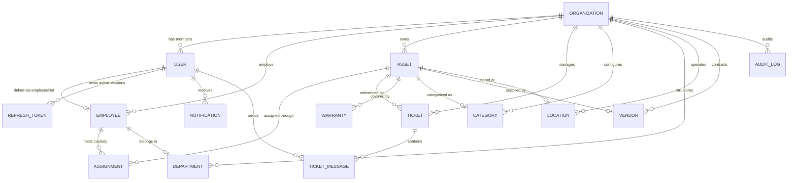

# AssetOwl MongoDB Data Model & Schema Guide

## 1. Entity Relationship (ER) Diagram

---

## 2. Comprehensive Model Specifications

### 1. `Organization` ([`Organization.js`](file:///c:/Projects/assetIQ-v2/backend/src/models/Organization.js))
- **Purpose**: Top-level tenant account.
- **Key Fields**: `name` (String), `slug` (String, unique), `code` (String, unique, sparse), `status` (`'active'` | `'suspended'`), `planId` (`'starter'` | `'professional'` | `'enterprise'`), `settings.autoApproveThreshold` (Number, default: $2,000).
- **Indexes**: `{ slug: 1 }` (unique), `{ code: 1 }` (unique, sparse).

### 2. `User` ([`User.js`](file:///c:/Projects/assetIQ-v2/backend/src/models/User.js))
- **Purpose**: Authenticated account identity.
- **Key Fields**: `email` (String, lowercase, unique), `passwordHash` (String), `role` (`'super_admin'` | `'org_admin'` | `'asset_manager'` | `'employee'`), `organizationId` (Ref: Organization), `employeeRef` (Ref: Employee), `status` (`'active'` | `'inactive'`).
- **Indexes**: `{ email: 1 }` (unique), `{ organizationId: 1 }`.

### 3. `RefreshToken` ([`RefreshToken.js`](file:///c:/Projects/assetIQ-v2/backend/src/models/RefreshToken.js))
- **Purpose**: Long-lived session tokens for silent access token rotation.
- **Key Fields**: `userId` (Ref: User), `token` (String, unique), `expiresAt` (Date).
- **Indexes**: `{ expiresAt: 1 }` with `{ expires: "0s" }` (MongoDB TTL auto-deletion).

### 4. `Employee` ([`Employee.js`](file:///c:/Projects/assetIQ-v2/backend/src/models/Employee.js))
- **Purpose**: Personnel directory profile for equipment custodians.
- **Key Fields**: `organizationId` (Ref), `firstName`, `lastName`, `email`, `departmentId` (Ref: Department), `jobTitle`, `status` (`'active'` | `'offboarded'`).
- **Constraint**: Cannot be deleted if active unreturned assignments exist.

### 5. `Asset` ([`Asset.js`](file:///c:/Projects/assetIQ-v2/backend/src/models/Asset.js))
- **Purpose**: Physical hardware inventory item.
- **Key Fields**: `name`, `assetCode` (String, unique per org), `serialNumber`, `categoryId` (Ref), `status` (`'stock'` | `'assigned'` | `'repair'` | `'retired'`), `purchasePrice` (Number), `purchaseDate` (Date), `locationId` (Ref), `vendorId` (Ref).
- **Indexes**: `{ organizationId: 1, assetCode: 1 }` (unique), `{ organizationId: 1, status: 1 }`, `{ organizationId: 1, createdAt: -1 }`.

### 6. `Assignment` ([`Assignment.js`](file:///c:/Projects/assetIQ-v2/backend/src/models/Assignment.js))
- **Purpose**: Historical and active custody records linking an Asset to an Employee.
- **Key Fields**: `assetId` (Ref), `employeeId` (Ref), `assignedBy` (Ref: User), `assignedAt` (Date), `returnInitiatedAt` (Date), `returnReason` (`'offboarding'` | `'upgrade'` | `'defective'`), `inspectedAt` (Date), `inspectedBy` (Ref: User), `inspectionResult` (`'pass'` | `'fail_repair'` | `'fail_retire'`), `returnedAt` (Date).
- **Indexes**: `{ organizationId: 1, employeeId: 1, returnedAt: 1 }`, `{ organizationId: 1, assetId: 1, returnedAt: 1 }`, `{ organizationId: 1, returnInitiatedAt: 1, returnedAt: 1 }`.

### 7. `Ticket` ([`Ticket.js`](file:///c:/Projects/assetIQ-v2/backend/src/models/Ticket.js))
- **Purpose**: Support, repair, return, and procurement service requests.
- **Key Fields**: `organizationId` (Ref), `raisedBy` (Ref: User), `handler` (Ref: User), `type` (`'repair'` | `'request'` | `'return'` | `'support'` | `'admin_support'`), `status` (`'open'` | `'claimed'` | `'in_progress'` | `'resolved'` | `'closed'`), `priority` (`'p1'` | `'p2'` | `'p3'` | `'p4'`), `assetId` (Ref: Asset), `isEscalated` (Boolean), `resolutionNotes` (String), `resolvedAt` (Date), `resolvedBy` (Ref: User).
- **Indexes**: `{ organizationId: 1, status: 1 }`, `{ organizationId: 1, handler: 1 }`, `{ organizationId: 1, createdAt: -1 }`.

### 8. `TicketMessage` ([`TicketMessage.js`](file:///c:/Projects/assetIQ-v2/backend/src/models/TicketMessage.js))
- **Purpose**: Real-time conversation thread for tickets.
- **Key Fields**: `ticketId` (Ref: Ticket), `senderId` (Ref: User), `senderName`, `senderRole`, `message`, `isInternal` (Boolean, staff-only notes), `isSystemMessage` (Boolean).
- **Indexes**: `{ ticketId: 1, createdAt: 1 }`, `{ organizationId: 1 }`.

### 9. `Warranty` ([`Warranty.js`](file:///c:/Projects/assetIQ-v2/backend/src/models/Warranty.js))
- **Purpose**: OEM and vendor warranty coverage records.
- **Key Fields**: `organizationId` (Ref), `assetId` (Ref: Asset), `provider`, `policyNumber`, `startDate` (Date), `endDate` (Date), `status` (`'active'` | `'expired'` | `'alerted'`), `alertSent` (Boolean).
- **Indexes**: `{ organizationId: 1, endDate: 1 }`, `{ assetId: 1 }`.

### 10. `Notification` ([`Notification.js`](file:///c:/Projects/assetIQ-v2/backend/src/models/Notification.js))
- **Purpose**: User-specific in-app alerts.
- **Key Fields**: `userId` (Ref: User), `organizationId` (Ref), `type` (`'ticket_claimed'` | `'ticket_resolved'` | `'asset_assigned'` | `'return_initiated'` | `'inspection_completed'` | `'warranty_alert'` | `'warranty_expiry'`), `title`, `message`, `read` (Boolean, default: false).
- **Indexes**: `{ userId: 1, read: 1, createdAt: -1 }`, `{ organizationId: 1, createdAt: -1 }`.

### 11. `AuditLog` ([`AuditLog.js`](file:///c:/Projects/assetIQ-v2/backend/src/models/AuditLog.js))
- **Purpose**: Immutable compliance log tracking critical security and asset state changes.
- **Key Fields**: `organizationId` (Ref), `actorId` (Ref: User), `actorRole`, `action` (Enum of 17 actions), `targetType` (`'asset'` | `'ticket'` | `'assignment'` | `'user'`), `targetId`, `metadata` (Mixed), `createdAt` (Date, immutable).
- **Safety Pre-Hooks**: Throws error if `update*` or `delete*` operations are invoked on the model to guarantee audit immutability.

### 12. Supporting Catalog Models
- **`Category`**: Asset classification with `expectedLifespanMonths` (default: 36). Indexed on `{ organizationId: 1, name: 1 }` (unique).
- **`Department`**: Organizational department with unique `code`. Indexed on `{ organizationId: 1, code: 1 }`.
- **`Location`**: Hierarchical location tree (`branch` → `building` → `floor` → `room`). Indexed on `{ organizationId: 1, code: 1 }`.
- **`Vendor`**: Supplier contact and contract directory. Indexed on `{ organizationId: 1, name: 1 }`.
- **`Plan`**: SaaS subscription tier tiers (`starter`, `professional`, `enterprise`) with limits on `maxAssets` and `maxEmployees`.
