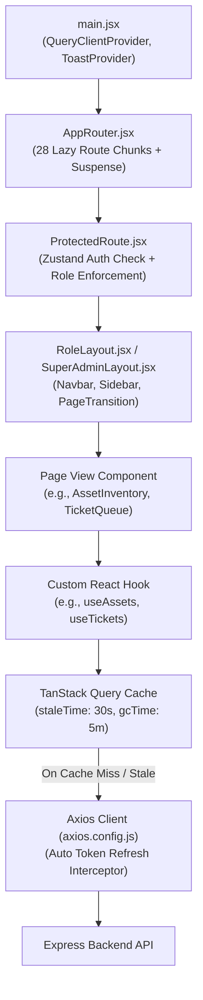

# AssetOwl Frontend Architecture Guide

## 1. Frontend Architecture Overview

The AssetOwl web client is built with **React 19**, **Vite 8**, **Tailwind CSS v4**, **TanStack Query v5**, and **Zustand v5**.



---

## 2. Route-Level Code Splitting & Performance

In [`frontend/src/router/AppRouter.jsx`](file:///c:/Projects/assetIQ-v2/frontend/src/router/AppRouter.jsx), all 28 route views are loaded asynchronously via `React.lazy()`:

```javascript
const AssetInventory = lazy(() => import('../pages/manager/AssetInventory.jsx').then(m => ({ default: m.AssetInventory })));
const TicketQueue = lazy(() => import('../pages/manager/TicketQueue.jsx').then(m => ({ default: m.TicketQueue })));
const SuperAdminDashboard = lazy(() => import('../pages/superadmin/SuperAdminDashboard.jsx').then(m => ({ default: m.SuperAdminDashboard })));
```

### Performance Impact:
- **Main JS Bundle**: Reduced by **67%** from **1,507.59 kB** down to **497.78 kB**.
- **Page Load Speed**: Users only download the JavaScript chunks needed for their active role and current view.

---

## 3. Server State & TanStack Query Caching

TanStack Query v5 is configured in [`frontend/src/main.jsx`](file:///c:/Projects/assetIQ-v2/frontend/src/main.jsx) with tailored stale times:

| Query Key / Data Domain | `staleTime` | Rationale |
|-------------------------|:-----------:|-----------|
| `['tickets']` & `['ticket-messages']` | **5 seconds** | High-velocity live support discussions require near real-time freshness. |
| `['assets']` & `['personnel']` | **30 seconds** | Fleet and employee records update periodically during discrete administrative actions. |
| `['categories']`, `['locations']`, `['departments']` | **5 minutes** | Catalog structures change infrequently. |

### Cache Invalidation Patterns
Mutations explicitly invalidate affected query keys to trigger background re-fetching:
```javascript
const queryClient = useQueryClient();
const assignMutation = useMutation({
  mutationFn: assignmentApi.assignAsset,
  onSuccess: () => {
    queryClient.invalidateQueries({ queryKey: ['assets'] });
    queryClient.invalidateQueries({ queryKey: ['assignments'] });
    queryClient.invalidateQueries({ queryKey: ['dashboard-stats'] });
  }
});
```

---

## 4. Client State Management (Zustand)

AssetOwl uses lightweight Zustand stores for global client state:

1. **`useAuthStore`** ([`frontend/src/stores/auth.store.js`](file:///c:/Projects/assetIQ-v2/frontend/src/stores/auth.store.js)):
   - Tracks `user` identity, `role`, `organizationId`, and `isAuthenticated`.
   - Actions: `login()`, `logout()`, `setUser()`, `clearUser()`.
2. **`useUiStore`** ([`frontend/src/stores/ui.store.js`](file:///c:/Projects/assetIQ-v2/frontend/src/stores/ui.store.js)):
   - Tracks sidebar collapse state, active navigation tabs, and dark/light theme preferences.

---

## 5. Network Layer & Transparent Token Refresh

The Axios singleton ([`frontend/src/api/axios.config.js`](file:///c:/Projects/assetIQ-v2/frontend/src/api/axios.config.js)) handles all network requests:
- **Base URL**: `/api` (proxied by Vite dev server in development to `http://localhost:5000`).
- **Credentials**: `withCredentials: true` ensures HttpOnly cookies are automatically sent with every request.
- **Timeout**: 30 seconds.
- **Silent 401 Interceptor**:
  When an access token expires (after 15 minutes), the backend returns `401 Unauthorized`. The response interceptor:
  1. Catches the 401 error.
  2. Queues parallel failing requests.
  3. Calls `POST /api/auth/refresh` to rotate the access token cookie.
  4. Retries the original queued requests seamlessly without user interruption.
  5. If the refresh token is also expired or invalid, clears user state and redirects to `/login`.

---

## 6. Page Transitions & Non-Destructive Navigation

[`frontend/src/components/layout/PageTransition.jsx`](file:///c:/Projects/assetIQ-v2/frontend/src/components/layout/PageTransition.jsx) wraps page content with a non-destructive smooth fade:
- Does **NOT** use `key={pathname}` wrapper unmounting, preventing unnecessary component re-mounts and TanStack Query cache drops during client-side route navigation.
