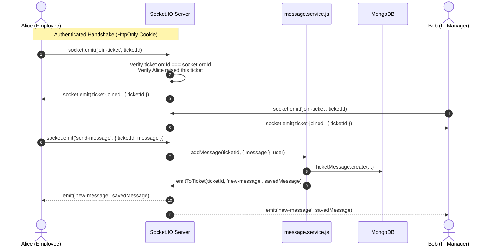

# AssetOwl Real-Time WebSocket Guide

## 1. Real-Time Architecture Overview

AssetOwl uses **Socket.IO 4** to provide bi-directional, event-driven communication for live ticket discussions, internal staff notes, and instant user notifications.



---

## 2. Authenticated Handshake & Connection Guards

In [`backend/src/config/socket.js`](file:///c:/Projects/assetIQ-v2/backend/src/config/socket.js), every incoming WebSocket connection is authenticated before the socket connection is accepted:

1. **Token Extraction**: Reads `accessToken` from `socket.handshake.headers.cookie` or fallback `Authorization: Bearer <token>`.
2. **Signature Verification**: Validates the JWT against `JWT_SECRET` via `verifyAccessToken()`.
3. **Identity Stamping**: Stalls and attaches identity directly to the socket instance:
   ```javascript
   socket.userId = decoded._id || decoded.id;
   socket.userEmail = decoded.email || '';
   socket.userRole = decoded.role || 'employee';
   socket.orgId = decoded.organizationId || null;
   ```
4. **Rejection**: If unauthenticated or malformed, calls `next(new Error('Authentication error: Access token missing'))`.

---

## 3. Room Naming & Authorization Rules

| Room Name | Access Rule | Purpose |
|-----------|-------------|---------|
| `user:${userId}` | Auto-joined upon connection | Private channel for direct notifications dispatched to this user. |
| `ticket:${ticketId}` | Explicit `join-ticket` event with server-side tenant and role verification | Live discussion room for ticket requesters and assigned managers. |

### Server-Side Room Join Checks ([`socket.js:81-132`](file:///c:/Projects/assetIQ-v2/backend/src/config/socket.js#L81-L132))
When a client requests to join `ticket:${ticketId}`:
1. **Tenant Isolation**: Verifies `String(ticket.organizationId) === String(socket.orgId)`. Cross-tenant join attempts are logged with security alerts and rejected.
2. **Employee Isolation**: If `socket.userRole === 'employee'`, verifies `ticket.raisedBy === socket.userId`. Employees cannot join or monitor ticket rooms for other employees.
3. **SuperAdmin Pass-through**: `super_admin` users are authorized to join any ticket room for cross-tenant platform support.

---

## 4. WebSocket Event Catalog

### Client-to-Server Events
- `join-ticket (ticketId: string)`: Requests authorization to join a ticket room.
- `leave-ticket (ticketId: string)`: Leaves a ticket room.
- `send-message ({ ticketId: string, message: string, isInternal?: boolean })`: Submits a message to a ticket discussion.

### Server-to-Client Events
- `ticket-joined ({ ticketId: string })`: Confirms authorized entry into the room.
- `new-message (messageObject)`: Broadcasts newly persisted message to all users in the ticket room.
- `notification (notificationObject)`: Pushes real-time alerts to the `user:${userId}` channel.
- `error ({ message: string })`: Emits operational or security error messages.

---

## 5. Frontend Socket Client Integration

In [`frontend/src/hooks/useSocket.js`](file:///c:/Projects/assetIQ-v2/frontend/src/hooks/useSocket.js):
- Initializes singleton `io` client with `withCredentials: true`.
- Automatically handles reconnection and joins room upon entering [`TicketDiscussionView.jsx`](file:///c:/Projects/assetIQ-v2/frontend/src/components/tickets/TicketDiscussionView.jsx).
- Invalidates TanStack Query cache `['tickets', id, 'messages']` upon receiving `new-message` events for reactive UI updates.
