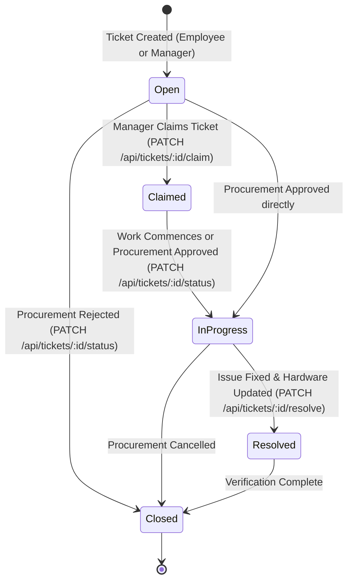
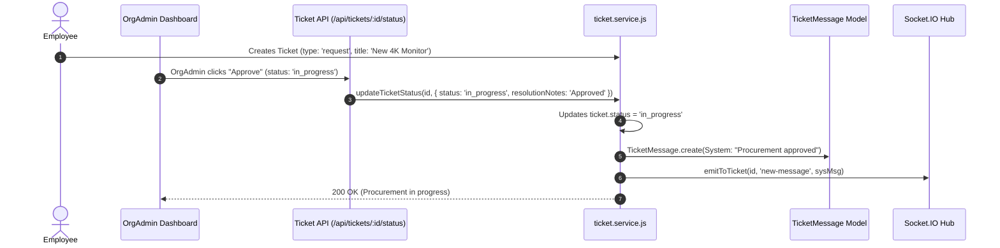

# AssetOwl Ticket & Procurement Workflow Guide

## 1. Ticket System Architecture

AssetOwl provides a unified service desk for IT support, hardware maintenance, equipment returns, and hardware procurement requests.

---

## 2. Ticket Types & Domain Routing

Tickets are classified into 5 primary types:

| Type | Intended Use Case | Typical Requester | Routing Domain |
|------|-------------------|-------------------|----------------|
| `repair` | Hardware defect, broken screen, battery failure | Employee / Manager | Hardware Team / Asset Manager |
| `request` | New hardware procurement, peripheral request | Employee | Org Admin (Pending Approvals) |
| `return` | Equipment return and surrender request | Employee | Asset Manager / Inspection Stepper |
| `support` | General IT support, software, network issues | Employee | IT Support Team |
| `admin_support`| Billing, plan upgrades, administrative questions | Org Admin | SuperAdmin Support Queue |

---

## 3. Priority Levels & SLA Escalations

- **`p1` (Critical)**: Total work stoppage / executive escalation. Auto-elevated on ticket escalation.
- **`p2` (High)**: Major degradation of hardware functionality.
- **`p3` (Medium)**: Standard hardware or procurement request.
- **`p4` (Low)**: Minor inquiry or long-term accessory request.

### Auto-Escalation ([`ticket.service.js:escalateTicket`](file:///c:/Projects/assetIQ-v2/backend/src/services/ticket.service.js))
When a ticket is escalated:
1. `ticket.isEscalated = true`.
2. Priority is elevated to `p1` if currently `p3` or `p4`.
3. Creates automated system broadcast message in ticket discussion.
4. Appears prominently in the Org Admin Exception Queue (`/admin/exceptions`).

---

## 4. Procurement Approval Flow

---

## 5. Maintenance Resolution & Asset State Changes

When an IT manager resolves a hardware repair ticket (`PATCH /api/tickets/:id/resolve` or `PATCH /api/tickets/:id/status`):
- The manager can pass `{ assetStateChange: 'stock' }` or `{ assetStateChange: 'retired' }`.
- The service automatically:
  1. Updates `ticket.status = 'resolved'`.
  2. Updates `ticket.resolvedAt = new Date()` and `ticket.resolvedBy = user._id`.
  3. Updates linked `Asset.status` (e.g., from `repair` back to `stock`).
  4. Records `asset_state_change` and `ticket_resolved` entries in `AuditLog`.
  5. Broadcasts real-time discussion update and notifies the employee.

---

## 6. Key Functions Reference

### `updateTicketStatus(ticketId, data, user)`
- **File**: [`backend/src/services/ticket.service.js`](file:///c:/Projects/assetIQ-v2/backend/src/services/ticket.service.js)
- **Inputs**: `ticketId`, `{ status, resolutionNotes, priority, assetStateChange }`, `user` context.
- **Why It Exists**: Handles arbitrary state transitions (`in_progress`, `closed`, `resolved`) for procurement and support workflows.
- **What Breaks If Changed**: Org Admin procurement approvals/rejections fail to transition correctly.

### `claimTicket(ticketId, priority, user)`
- **File**: [`backend/src/services/ticket.service.js`](file:///c:/Projects/assetIQ-v2/backend/src/services/ticket.service.js)
- **Inputs**: `ticketId`, `priority`, `user` context.
- **Behavior**: Sets `ticket.handler = user._id`, `ticket.status = 'claimed'`, and notifies employee.
