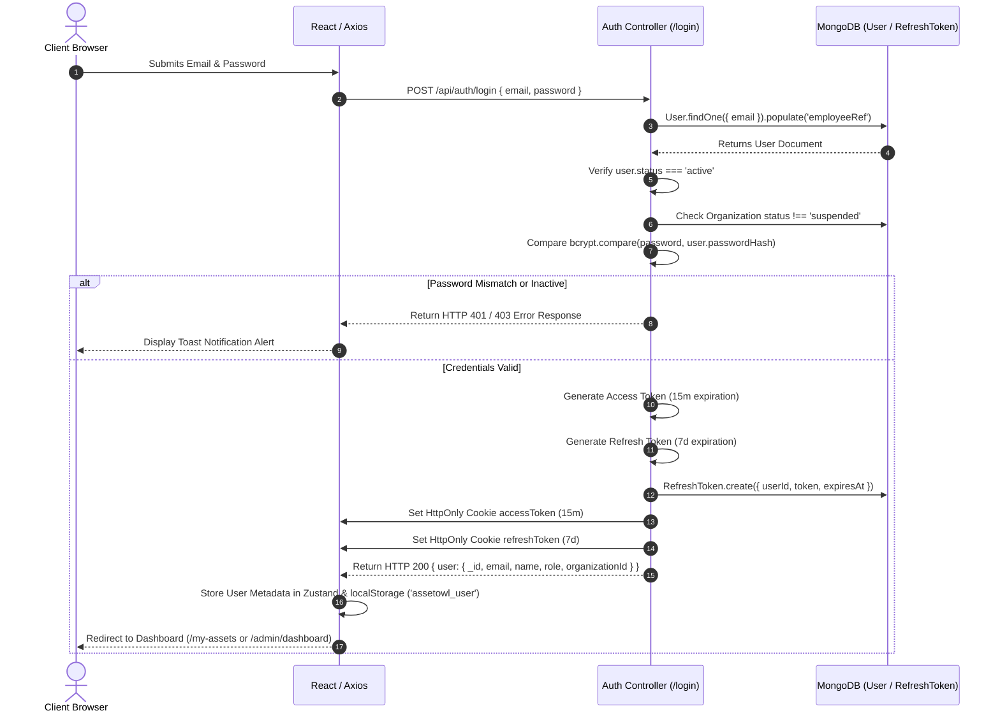
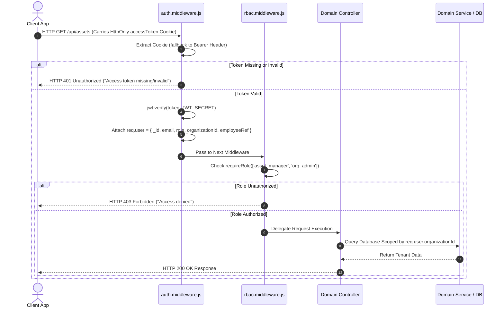
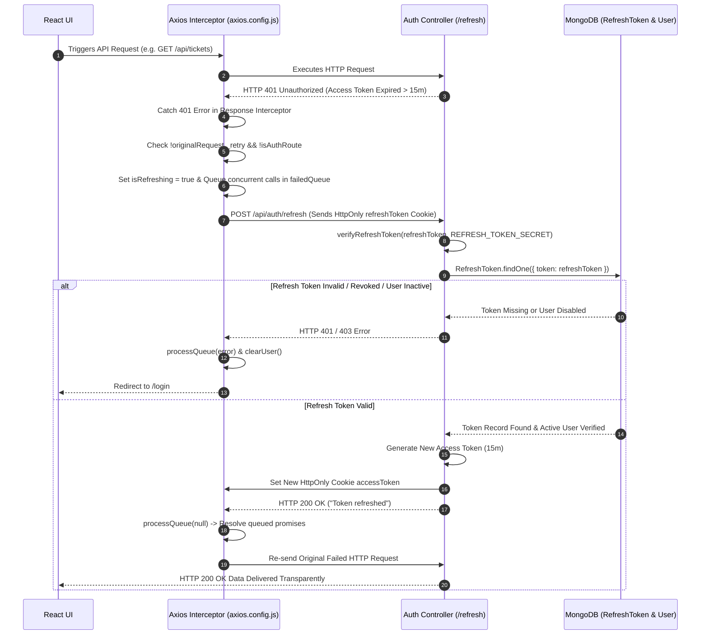
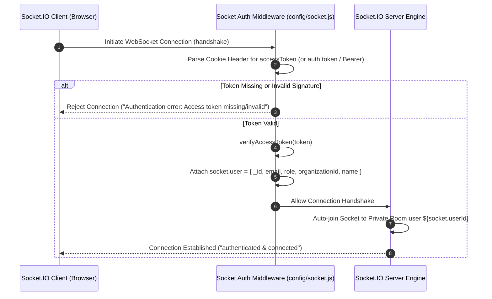

# Comprehensive Authentication, Authorization & Session Architecture

This document provides a complete, step-by-step technical explanation of the **Authentication, Authorization, Session Management, Silent Refresh, and Real-Time Security** architecture in AssetIQ v2.

---

## 1. Executive Summary & Architecture Overview

AssetIQ implements a **Dual-Token, Multi-Tenant Session System** combining short-lived JWT Access Tokens, long-lived DB-backed Refresh Tokens, HttpOnly cookies, and Socket.IO WebSocket handshake authentication.

```text
┌─────────────────────────────────────────────────────────────────────────────┐
│                              FRONTEND (Vite / React)                        │
│  Zustand Auth Store (client UI state) + Axios Interceptor (silent refresh)  │
└──────────────────────────────────────┬──────────────────────────────────────┘
                                       │ HttpOnly Cookies (accessToken, refreshToken)
                                       ▼
┌─────────────────────────────────────────────────────────────────────────────┐
│                           BACKEND (Express REST API)                        │
│   auth.middleware.js (JWT verify)  ──►  rbac.middleware.js (Role check)     │
└──────────────────────────────────────┬──────────────────────────────────────┘
                                       │ DB Lookup & Validation
                                       ▼
┌─────────────────────────────────────────────────────────────────────────────┐
│                              DATABASE (MongoDB)                             │
│   User Model (bcrypt hash)  │  RefreshToken Model (TTL Index 7 days)       │
└─────────────────────────────────────────────────────────────────────────────┘
```

### Key Security Features
* **Stateless Short-Lived Access Tokens**: 15-minute expiration (`JWT_EXPIRE`). Signed with `JWT_SECRET`. Carries user identity, role, and tenant `organizationId`.
* **Database-Backed Refresh Tokens**: 7-day expiration (`REFRESH_TOKEN_EXPIRE`). Stored in MongoDB collection `RefreshToken` with automatic TTL index deletion (`expires: "0s"`).
* **HttpOnly & Secure Cookies**: Mitigates Cross-Site Scripting (XSS) by preventing JavaScript `document.cookie` access to session tokens.
* **Transparent Silent Refresh Queue**: Axios response interceptor catches HTTP `401 Unauthorized` errors, pauses outgoing API calls, calls `/api/auth/refresh`, updates the cookie, and replays failed requests seamlessly.
* **Multi-Tenant Isolation & RBAC**: Every database query is scoped by `organizationId`. Four strict user roles exist: `super_admin`, `org_admin`, `asset_manager`, `employee`.
* **Realtime Socket Handshake Auth**: Socket.IO connections inspect `accessToken` cookies or headers during connection handshakes before allowing users to join private WebSocket rooms.

---

## 2. Sequence Diagrams & System Flows

### 2.1 User Login & Token Issuance Flow



---

### 2.2 Protected REST Endpoint & RBAC Verification Flow



---

### 2.3 Transparent 401 Interception & Silent Token Refresh Flow



---

### 2.4 Realtime Socket.IO Handshake Authentication Flow



---

## 3. Data Models & Credential Storage Details

### 3.1 User Model (`backend/src/models/User.js`)
Stores user authentication credentials, RBAC role, and organization tenant association.

```javascript
{
  email: {
    type: String,
    required: true,
    unique: true,
    lowercase: true,  // Automatically lowercased before query/insert
    trim: true
  },
  passwordHash: {
    type: String,
    required: true   // Salted bcrypt hash string (never plaintext)
  },
  role: {
    type: String,
    enum: ["super_admin", "org_admin", "asset_manager", "employee"],
    required: true
  },
  organizationId: {
    type: mongoose.Schema.Types.ObjectId,
    ref: "Organization",
    index: true,
    default: null   // Null for global SuperAdmins
  },
  organizationName: {
    type: String,
    trim: true,
    default: ""
  },
  employeeRef: {
    type: mongoose.Schema.Types.ObjectId,
    ref: "Employee",
    default: null   // Link to detailed Employee profile
  },
  status: {
    type: String,
    enum: ["active", "inactive"],
    default: "active"
  }
}
```

### 3.2 Refresh Token Model (`backend/src/models/RefreshToken.js`)
Stores active refresh token strings to enforce session revocation capabilities and auto-expiry.

```javascript
{
  userId: {
    type: mongoose.Schema.Types.ObjectId,
    ref: "User",
    required: true,
    index: true
  },
  token: {
    type: String,
    required: true,
    unique: true
  },
  expiresAt: {
    type: Date,
    required: true,
    index: { expires: "0s" } // MongoDB TTL index: automatically deletes document when expiresAt date is reached
  },
  createdAt: {
    type: Date,
    default: Date.now
  }
}
```

---

## 4. Token Generation & Verification Specifications

File Path: [`backend/src/utils/token.utils.js`](file:///c:/Projects/assetIQ-v2/backend/src/utils/token.utils.js)

### 4.1 Access Token Generation (`generateAccessToken`)
* **Expiration**: 15 minutes (`JWT_EXPIRE = 15m`).
* **Secret**: `JWT_SECRET`.
* **Payload Claims**:
  ```json
  {
    "_id": "64f1a2b3c4d5e6f7a8b9c0d1",
    "email": "alex.admin@acme.com",
    "role": "org_admin",
    "organizationId": "64f1a2b3c4d5e6f7a8b9c000",
    "employeeRef": "64f1a2b3c4d5e6f7a8b9c999",
    "iat": 1756295000,
    "exp": 1756295900
  }
  ```

### 4.2 Refresh Token Generation (`generateRefreshToken`)
* **Expiration**: 7 days (`REFRESH_TOKEN_EXPIRE = 7d`).
* **Secret**: `REFRESH_TOKEN_SECRET`.
* **Payload Claims**:
  ```json
  {
    "_id": "64f1a2b3c4d5e6f7a8b9c0d1",
    "iat": 1756295000,
    "exp": 1756900000
  }
  ```

### 4.3 Cookie Delivery Configuration
Cookies are delivered via standard Express `res.cookie()` headers:

```javascript
const accessTokenCookieOptions = {
  httpOnly: true,                                // Inaccessible to JavaScript document.cookie
  secure: process.env.NODE_ENV === 'production', // Sent only over HTTPS in production
  sameSite: process.env.NODE_ENV === 'production' ? 'strict' : 'lax',
  maxAge: 15 * 60 * 1000                         // 15 minutes
};

const refreshTokenCookieOptions = {
  httpOnly: true,
  secure: process.env.NODE_ENV === 'production',
  sameSite: process.env.NODE_ENV === 'production' ? 'strict' : 'lax',
  maxAge: 7 * 24 * 60 * 60 * 1000                // 7 days
};
```

---

## 5. Detailed Step-by-Step API Route Walkthroughs

### 5.1 User Registration (`POST /api/auth/register`)
1. **Input Normalization**: Accepts `email`, `password`, `name` or `firstName`/`lastName`, and optional `organizationCode`. Email is converted to lowercase and trimmed.
2. **Duplicate Inspection**: Checks if `User.findOne({ email: normalizedEmail })` exists. If so, throws `HTTP 409 Conflict`.
3. **Organization Resolution**:
   * If `organizationCode` is provided: Looks up `Organization` by `code` or `slug`. If found and active, assigns the new user `organizationId` and sets role to `'employee'`.
   * If `organizationCode` is omitted: In production, returns `HTTP 403 Forbidden` (public tenant self-creation disabled). In development, automatically creates a new test `Organization` and assigns role `'org_admin'`.
4. **Password Hashing**: Generates salt with `bcrypt.genSalt(10)` and hashes password with `bcrypt.hash(password, salt)`.
5. **Employee & User Creation**:
   * Creates an [`Employee`](file:///c:/Projects/assetIQ-v2/backend/src/models/Employee.js) record storing first name, last name, and job title.
   * Creates the [`User`](file:///c:/Projects/assetIQ-v2/backend/src/models/User.js) record linked via `employeeRef: employee._id`.
6. **Response**: Returns `HTTP 201 Created` with non-sensitive user profile data.

---

### 5.2 User Login (`POST /api/auth/login`)
1. **Validation**: Checks presence of `email` and `password`.
2. **Account Retrieval**: Finds `User` document by lowercased email and populates `employeeRef`. Throws `HTTP 401` if user does not exist.
3. **Status Checks**:
   * Verifies `user.status === "active"`. Throws `HTTP 403` if account is disabled.
   * If user belongs to an organization, verifies `Organization.status === "active"`. Throws `HTTP 403` if organization is suspended.
4. **Password Verification**: Calls `bcrypt.compare(password, user.passwordHash)`. Throws `HTTP 401` if hash comparison fails.
5. **Token Issuance**:
   * Generates Access Token and Refresh Token.
   * Creates a [`RefreshToken`](file:///c:/Projects/assetIQ-v2/backend/src/models/RefreshToken.js) record in MongoDB with `expiresAt = Date.now() + 7 days`.
6. **Cookie & Response Delivery**: Sets `accessToken` and `refreshToken` HttpOnly cookies and returns HTTP 200 JSON user metadata.

---

### 5.3 Token Refresh (`POST /api/auth/refresh`)
1. **Cookie Extraction**: Reads `refreshToken` string from `req.cookies.refreshToken`. Throws `HTTP 401` if missing.
2. **Signature Verification**: Verifies JWT signature using `verifyRefreshToken(refreshToken)`.
3. **Database Revocation Check**: Searches MongoDB for `RefreshToken.findOne({ token: refreshToken })`. If missing or revoked, throws `HTTP 401`.
4. **User & Org Status Re-Verification**: Loads User and Organization from DB. Ensures both are active. If inactive, deletes token from DB (`RefreshToken.deleteOne`) and throws `HTTP 401` / `HTTP 403`.
5. **Re-Issuance**: Generates a fresh 15-minute Access Token, attaches updated HttpOnly cookie, and returns `HTTP 200 OK`.

---

### 5.4 User Logout (`POST /api/auth/logout`)
1. **Database Token Invalidation**: Reads `refreshToken` cookie. Deletes corresponding document from MongoDB (`RefreshToken.deleteOne({ token })`).
2. **Cookie Clearance**: Invokes `res.clearCookie('accessToken')` and `res.clearCookie('refreshToken')`.
3. **Frontend Store Reset**: Client receives response and executes `useAuthStore.getState().clearUser()`, wiping local state and `localStorage`.

---

## 6. Frontend Integration & Route Protection

### 6.1 Zustand Auth Store (`frontend/src/stores/auth.store.js`)
Manages global client authentication state:

```javascript
export const useAuthStore = create((set, get) => ({
  user: getStoredUser(),            // Initial state loaded from localStorage ('assetowl_user')
  isAuthenticated: Boolean(getStoredUser()),
  isLoading: !getStoredUser(),

  initialize: async () => {
    try {
      const res = await me();        // Calls GET /api/auth/me to verify cookie session
      const userData = res.data?.user || res.data;
      localStorage.setItem('assetowl_user', JSON.stringify(userData));
      set({ user: userData, isAuthenticated: true, isLoading: false });
    } catch {
      localStorage.removeItem('assetowl_user');
      set({ user: null, isAuthenticated: false, isLoading: false });
    }
  },

  login: async (email, password) => { /* Calls login API, sets state & localStorage */ },
  logout: async () => { /* Calls logout API, clears state & localStorage */ },
  clearUser: () => { /* Wipes auth state on 401 refresh failure */ }
}));
```

---

### 6.2 Protected Route Guard (`frontend/src/components/layout/ProtectedRoute.jsx`)
Guards React UI routes based on authentication state and user roles:

```javascript
export const ProtectedRoute = ({ allowedRoles = [], children }) => {
  const { isAuthenticated, user, isLoading } = useAuthStore();
  const location = useLocation();

  if (isLoading && !isAuthenticated) {
    return <LottieLoader message="Loading AssetOwl..." fullPage />;
  }

  if (!isAuthenticated) {
    return <Navigate to="/login" state={{ from: location }} replace />;
  }

  if (allowedRoles.length > 0 && user && !allowedRoles.includes(user.role)) {
    const redirectPath = ROLE_DEFAULT_ROUTES[user.role] || '/my-assets';
    return <Navigate to={redirectPath} replace />;
  }

  return children ? children : <Outlet />;
};
```

---

## 7. Summary Matrix of Roles & Permissions

| Role | Organization Scope | Target Dashboard Route | System Capabilities |
| :--- | :--- | :--- | :--- |
| `super_admin` | Global (All Orgs) | `/admin/dashboard` | Manage all tenants, plans, global analytics, platform support requests, read-only operational ticket audit mode |
| `org_admin` | Single Tenant | `/admin/dashboard` | Manage tenant personnel, categories, departments, locations, vendors, assets, procurement approvals |
| `asset_manager` | Single Tenant | `/manager/dashboard` | Create/edit assets, issue asset assignments, complete return inspections, manage maintenance tickets |
| `employee` | Single Tenant | `/my-assets` | View assigned hardware, initiate asset returns, submit maintenance tickets, reply to raised ticket chats |

---
*Document created for AssetIQ v2 Architecture Reference (`docs/authentication.md`).*
